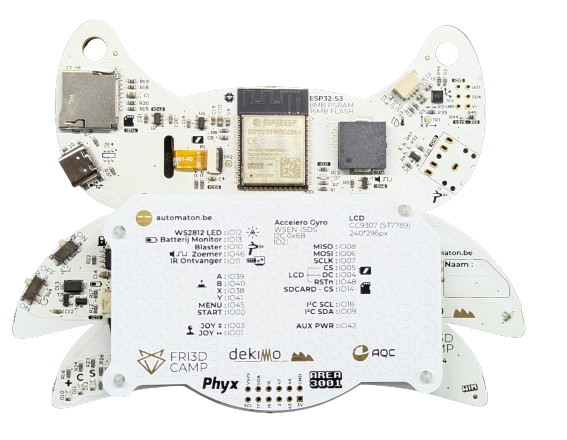

# Badge 2024 hardware
In deze Git repository kan je de ontwerpbestanden en productiedata vinden van de [Fri3d Camp](https://fri3d.be/) 2024 badge. Revisie 01 is de versie die op kamp zal uitgedeeld worden.

De badge is gebouwd rond de **Espressif [ESP32-S3-WROOM-1-N16R8](Datasheets/esp32-s3-wroom-1_wroom-1u_datasheet_en.pdf) module** met :

- 16MB flash 
- 8MB PSRAM. 
- De [ESP32-S3](Datasheets/esp32-s3_datasheet_en.pdf) dual-core Xtensa LX7 microcontroller (geklokt aan 240MHz)
- Wi-Fi (via de ESP32)
- Bluetooth 5 (via de ESP32

Omdat deze microcontroller zelf een USB interface heeft is er geen nood meer om een USB serial brug te voorzien zoals op de [badge van 2022]( https://github.com/Fri3dCamp/badge-2020) en de [badge van 2018]( https://github.com/Fri3dCamp/badge). 

We hebben de badge ook uitgerust met:

- [6-assige IMU van Würth Elektronik](Datasheets/Wurth-WSEN-ISDS.pdf)
- buzzer
- veel knoppen
- joystick
- microSD kaart lezer
- een prachtige [2” IPS LCD met afgeronde hoeken](Datasheets/QT020JA001-A0_SPEC.pdf).

Er is opnieuw een [tweede voeding](Datasheets/xc6210.pdf) geplaatst om de Wi-Fi module afzonderlijk van voeding te voorzien. In deze versie hadden we gelukkig genoeg vrije I/O om deze 2de voeding ook aan te kunnen sturen. Om energie te besparen kan je deze dus uitschakelen, enkel de ESP32-S3 zal dan nog stroom krijgen. 

Om het geheel van stroom te voorzien gebruiken we deze keer een [2000mAh lithium polymeer cel](Datasheets/2000mAh_704060_battery_Tewaycell.pdf) met een ingebouwd beschermingscircuit. Deze batterijen zijn mechanisch niet zo sterk als de 18650 cellen die we in vorige editie gebruikten, daarom heeft de badge standaard een cover om de batterij te beschermen. 

Om de batterij op te laden via de ingebouwde USB-C poort, maken we opnieuw gebruik van de [TP4056 lineaire lader](Datasheets/TP4056.pdf). 

Er is ook een aansluiting voor de [blaster]( https://github.com/Fri3dCamp/blaster_2024) ([die van 2022]( https://github.com/Fri3dCamp/timeblaster-2020) is ook compatibel met deze badge!). 

We hebben plek voorzien voor een [SAO header]( https://hackaday.com/2019/03/20/introducing-the-shitty-add-on-v1-69bis-standard/) en is er onderaan een eigen uitbreidingsconnector waar je makkelijk een draadje in kan steken om te experimenteren.

# Badge 2024 hardware (EN)
This repository contains the hardware design and production files for the [Fri3d Camp](https://fri3d.be/en/) 2024 badge.
Revision 01 will be handed out during the event.

